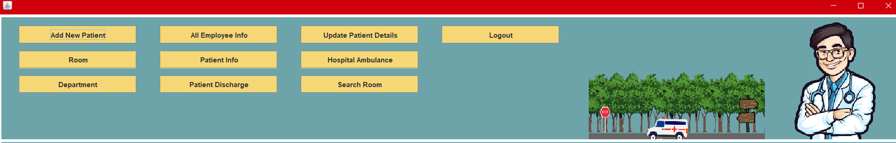

# hospital-management-system
## Login panel 

## Reception panel

## Add Patient Panal

## Department Panal

## Room Panal

## Employee_info Panal

## Patient_Info panal

## Discharge Panal

##  Update Patient Details panal

