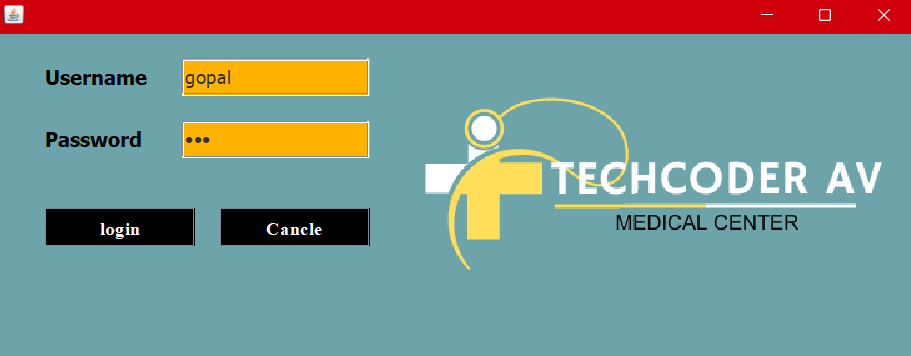

# hospital-management-system

🏥 Hospital Management System

📌 Overview

The Hospital Management System (HMS) is a web-based or desktop-based software application designed to efficiently manage all aspects of hospital administration, patient records, and staff management. This system enables seamless tracking of patients, employees, hospital infrastructure, and other critical operations.

🚀 Features

✅ Authentication System

User login & registration (Admin, Doctor, Nurse, Receptionist, etc.)

Secure authentication with role-based access

✅ Patient Management

Add, edit, update, and delete patient records

Patient discharge details

Medical history tracking

✅ Doctor & Employee Management

Employee database (doctors, nurses, admin staff)

Departmental details

Employee work schedule & assignments

✅ Hospital Infrastructure

Room allocation (available & occupied rooms)

Department information

✅ Ambulance & Emergency Services

Search for available ambulances

Track ambulance services

✅ Billing & Payments

Generate patient bills

Manage payment records

✅ Reports & Logs

Generate hospital reports

Monitor patient history

User activity logs

✅ User Dashboard

Custom dashboard for admin, doctors, and receptionists

Summary of appointments, patients, and hospital statistics

✅ Logout System

Secure user logout
## Login panel 

## Reception panel

## Add Patient Panal

View patient history and medical details.

## Department Panal

## Room Panal

## Employee_info Panal

## Patient_Info panal

## Discharge Panal

##  Update Patient Details panal

